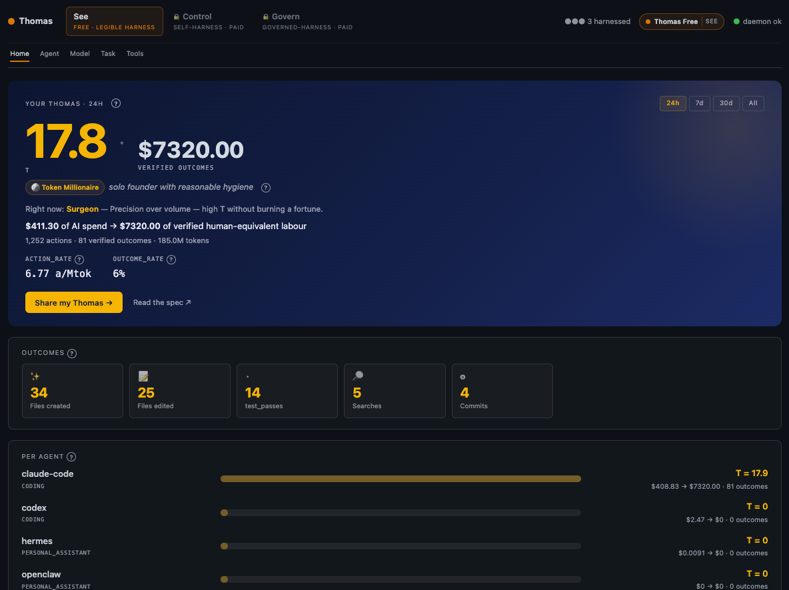

# mythosharness

A long-running, **self-evolving** vulnerability-discovery harness that gives
**any strong coding model** Mythos-class output.

The thesis: Cloudflare's Mythos paper showed a specialized security model can
chain low-severity bugs into working exploits — but most of the gap between a
generic coding agent and Mythos isn't the model, it's the **harness**. Build
the right Recon → Hunt → Validate → Gapfill → Report pipeline around any
strong coding model (Opus 4.7, GPT-5.5, DeepSeek V4, Gemini, …) and you can
approach the same output. This repo is that harness.

The codebase is written against `@anthropic-ai/sdk` for ergonomic reasons —
adaptive thinking, tool use, prompt caching all land cleanly. To point it at
a non-Anthropic model, route the SDK's traffic through **Thomas**, the
open-source agent wire harness — see [Connecting other models](#connecting-other-models-via-thomas)
below.

The harness extends the Mythos pipeline with three things Mythos doesn't have:

- **Email-driven I/O** — the operator gives instructions by email; the harness
  emails back hourly/daily reports of confirmed vulnerabilities.
- **Skill distillation** — every confirmed exploit (and notable miss) gets
  rolled into a markdown skill that future hunters auto-load.
- **Self-mutating code** — the harness proposes patches to its own source,
  gates them behind a smoke test, and commits to GitHub.
- **Indefinite autonomy** — runs forever until the operator emails `stop` or
  `KILL_SWITCH=1` is set.

## Why not a generic coding agent?

Cloudflare's writeup (`https://blog.cloudflare.com/cyber-frontier-models/`)
identifies two failure modes when a generic coding harness is pointed at a
vulnerability-research task:

1. **Context mismatch.** Coding agents hold a single hypothesis; vuln research
   is narrow + parallel. A single session can cover ~0.1% of a large repo
   before compaction discards earlier findings.
2. **Throughput.** Single-stream agents can't fan out. Useful for manual leads,
   wrong for coverage.

The fix is a structured pipeline of narrow, parallel agents with adversarial
review and structured output — that's what this repo implements.

## Pipeline

```
            ┌──────────┐
   operator │  Inbox   │  ──── commands (target add, stop, focus, …) ──┐
            └──────────┘                                                │
                                                                        ▼
┌────────┐  ┌──────┐  ┌──────────────┐  ┌──────────┐  ┌────────┐  ┌─────────┐
│ Recon  │─►│ Hunt │─►│  Validate    │─►│  Gapfill │─►│ Dedupe │─►│  Trace  │
│ (arch) │  │ N× ║║ │  (adversarial)│  │  re-queue│  │ root‑   │  │ x-repo  │
└────────┘  └──┬───┘  └──────────────┘  └──────────┘  │ cause   │  │ reach   │
               │ each hunter gets:                    └────────┘  └────┬────┘
               │   • one attack class                                  │
               │   • one scope hint                                    ▼
               │   • shared arch doc                              ┌─────────┐
               │   • per-task scratch dir for PoC                 │ Report  │
               └─────────────────────────────────────────────────►│ (mail+  │
                                                                  │ github) │
                                                                  └─────────┘
                                  ▲                                    │
                                  └────────── reflection ──────────────┤
                                       (new skills, harness mutations) │
                                                                       ▼
                                                              git commit + push
```

## Running

```bash
bun install
cp .env.example .env  # fill in keys
bun run start         # forever loop
bun run once          # one pipeline tick, useful for debugging
bun run smoke         # unit tests
```

The operator emails the address in `MAIL_USER`. Recognised commands:

```
subject: target add
body:    https://github.com/some/repo
         focus: deserialization, ssrf

subject: stop                # graceful shutdown
subject: pause               # stop scheduling new hunters but keep email loop
subject: resume
subject: status              # one-shot status reply
subject: focus
body:    use-after-free in src/parser/
```

Replies arrive on the schedule set by `REPORT_INTERVAL_MIN`.

## Connecting other models via Thomas



The harness calls models through `@anthropic-ai/sdk`. To run it on a
**different** model — GPT-5.5, DeepSeek V4, Gemini, an OpenRouter route, a
self-hosted vLLM, anything OpenAI-compatible — install
[Thomas][thomas] and let it sit on the wire. Thomas is the open-source agent
harness layer that handles capture, decode, routing, and outcome scoring:

```bash
npm install -g @openthomas/thomas

thomas wire                  # detect agents, install taps, start daemon
# …run the harness as usual…
bun run start
thomas thomas                # see your T score (verified outcome / AI cost)
thomas                       # open the dashboard at http://localhost:9877
```

`thomas wire` is byte-exact reversible — `thomas unwire` restores every file
it touched. No telemetry, no cloud, no rewrites to this repo.

**Why Thomas is a particularly good fit for this harness:**

- Mythosharness produces *verifiable* outputs (reproduced PoCs). Thomas's
  `T_verified` metric — which scores only outcomes whose tool_result reports
  success — is exactly the right lens for a vulnerability-research run.
  *"19 failed attempts on a vulnerability search don't get scored as 19 wins."*
- Long, unattended runs (the whole point of this harness) are what make a
  flight recorder valuable. You can `thomas replay` any hunter that emitted
  a finding to understand what it actually did.
- Risk flags surface destructive shell, secret leak, and retry-storm patterns
  in agent traffic — useful safety rails on top of our own sandbox argv
  whitelist.

[thomas]: https://github.com/openthomas-com/thomas

## Layout

| Path                 | Role                                                |
|----------------------|-----------------------------------------------------|
| `src/orchestrator/`  | Long-running main loop + task queue                 |
| `src/stages/`        | recon / hunt / validate / gapfill / report          |
| `src/agents/`        | Tool-use loop, prompt caching                       |
| `src/sandbox/`       | Per-task scratch dirs, sandboxed exec               |
| `src/memory/`        | Findings DB, arch docs, skill loader                |
| `src/email/`         | IMAP poller + SMTP reporter                         |
| `src/github/`        | Auto-commit/push, self-mutation guard               |
| `src/selfimprove/`   | Reflection → skill writer → harness mutator         |
| `src/schemas/`       | Zod schemas (structured output, schema-validated)   |
| `skills/`            | Auto-loaded markdown skills (often self-generated)  |
| `data/`              | SQLite DBs, arch docs, scratch dirs, reports        |
| `targets/`           | Repos under analysis (cloned at runtime)            |

## Safety rails

- Sandboxed exec runs each PoC in a per-task scratch directory with a tight
  argv whitelist (`gcc`, `clang`, `bun`, `python3`, `node`, `cargo`, `make`,
  `cmake`, `pytest`).
- Self-mutations are written to a branch and smoke-tested before push. A
  failing smoke test aborts the commit.
- The harness refuses to operate on targets the operator hasn't explicitly
  added via email.
- `KILL_SWITCH=1` halts the orchestrator on the next tick.
- If running under Thomas, the `T_verified` score and full action trace
  give you an independent audit trail of what every hunter actually did.
